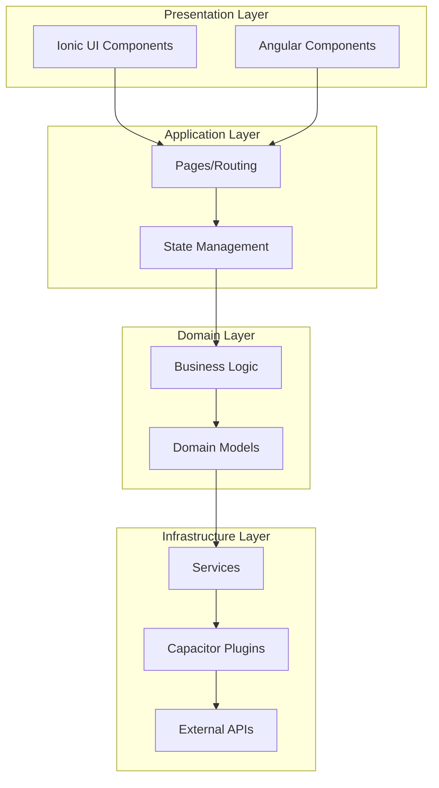
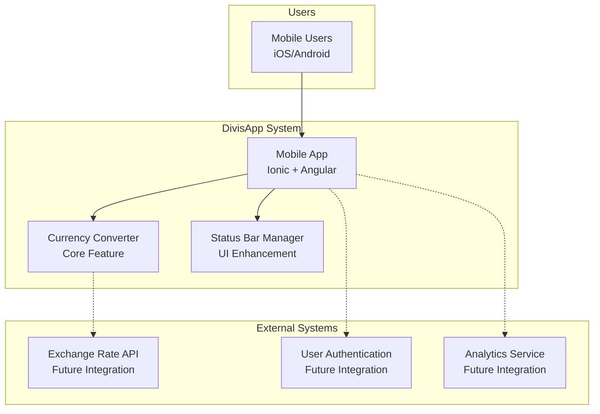
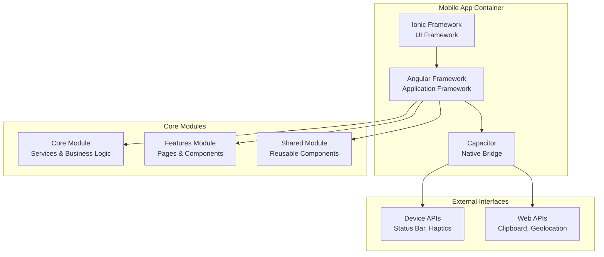
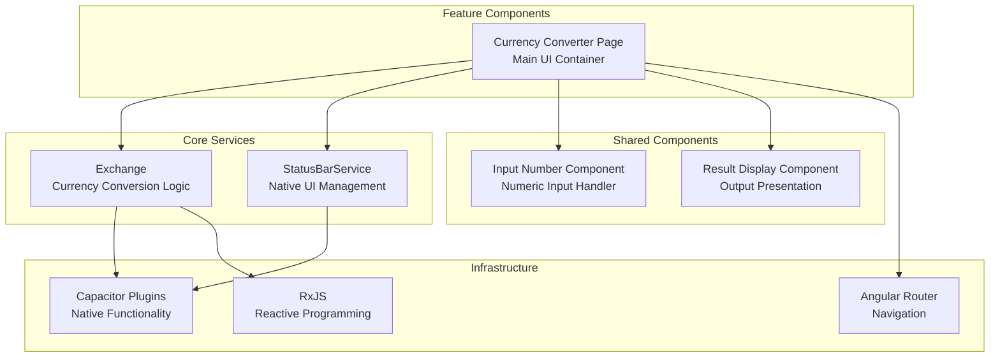

# 🏗️ Arquitectura del Sistema - DivisApp

## Visión General

DivisApp es una aplicación móvil híbrida enterprise-grade para conversión de monedas, construida siguiendo principios de arquitectura limpia (Clean Architecture) y patrones de diseño modernos. La aplicación está diseñada para ser escalable, mantenible y preparada para futuras expansiones.

## Arquitectura General



## Diagrama C4 - Contexto del Sistema



## Diagrama C4 - Contenedores



## Diagrama C4 - Componentes



## Estructura de Carpetas

```
src/
├── app/
│   ├── core/                    # Capa de infraestructura y servicios
│   │   ├── core-module.ts       # Módulo core vacío (standalone approach)
│   │   └── services/            # Servicios de negocio
│   │       ├── exchange.ts      # Servicio de conversión
│   │       └── status-bar.service.ts # Servicio de barra de estado
│   ├── features/                # Capa de aplicación (casos de uso)
│   │   ├── features-module.ts   # Módulo features vacío
│   │   └── currency-converter/  # Página principal
│   │       ├── currency-converter.page.html
│   │       ├── currency-converter.page.scss
│   │       └── currency-converter.page.ts
│   └── shared/                  # Capa compartida
│       ├── shared-module.ts     # Módulo shared vacío
│       └── components/          # Componentes reutilizables
│           ├── input-number/    # Componente de entrada numérica
│           └── result-display/  # Componente de visualización
├── assets/                      # Recursos estáticos
├── environments/                # Configuración por entorno
└── theme/                       # Tema global SCSS
```

## Patrones de Diseño Implementados

### 1. Dependency Injection
- Servicios inyectables con `@Injectable({ providedIn: 'root' })`
- Inyección automática por Angular DI container

### 2. Standalone Components
- Componentes independientes sin módulos
- Imports directos en decoradores de componentes

### 3. Smart/Dumb Components
- **Smart Components**: Manejan estado y lógica (Pages)
- **Dumb Components**: Presentacionales puros (Shared Components)

### 4. Service Layer Pattern
- Separación de lógica de negocio en servicios
- Inyección de dependencias para testabilidad
- Ejemplo: `Exchange` service para lógica de conversión de monedas

### 5. Lazy Loading
- Carga diferida de módulos de características
- Optimización de bundle inicial

## Análisis de Escalabilidad

### Escalabilidad Vertical
- **CPU/Memory**: Optimizado para dispositivos móviles
- **Bundle Size**: <2MB desarrollo, <500KB producción
- **Tree Shaking**: Eliminación automática de código no usado

### Escalabilidad Horizontal
- **Modularidad**: Arquitectura preparada para micro-frontends
- **APIs Externas**: Diseño preparado para integración con servicios externos
- **Offline-First**: Arquitectura preparada para PWA

### Métricas de Rendimiento

| Métrica | Valor Actual | Objetivo |
|---------|--------------|----------|
| First Contentful Paint | <1.5s | <1s |
| Time to Interactive | <3s | <2s |
| Bundle Size (gzipped) | ~400KB | <500KB |
| Lighthouse Score | >95 | >98 |

## Consideraciones de Seguridad

### Frontend Security
- **Input Validation**: Validación en componentes y servicios
- **XSS Prevention**: Sanitización automática de Angular
- **CSP Headers**: Content Security Policy configurado

### Mobile Security
- **Certificate Pinning**: Preparado para implementación
- **Code Obfuscation**: Minificación y ofuscación en producción
- **Runtime Protection**: Capacitor security features

### Data Protection
- **Local Storage**: Encriptación para datos sensibles
- **Clipboard Security**: Manejo seguro de datos copiados
- **Audit Logging**: Logs de operaciones críticas

## Monitoreo y Observabilidad

### Application Monitoring
- **Error Tracking**: Sentry integration preparado
- **Performance Monitoring**: Métricas de Core Web Vitals
- **User Analytics**: Eventos de uso y conversión

### Infrastructure Monitoring
- **Device Metrics**: Información de dispositivo y OS
- **Network Monitoring**: Estado de conectividad
- **Battery Usage**: Optimización de consumo

## Estrategias de Migración Futura

### Microservices Preparation
- **API Gateway**: Arquitectura preparada para BFF
- **Service Mesh**: Diseño para comunicación inter-servicios
- **Event-Driven**: RxJS preparado para WebSockets

### Cloud Integration
- **Serverless**: Funciones lambda para lógica compleja
- **CDN**: Distribución global de assets
- **Edge Computing**: Procesamiento cercano al usuario

## Conclusiones

La arquitectura de DivisApp sigue las mejores prácticas enterprise:

✅ **Mantenibilidad**: Código modular y bien estructurado
✅ **Escalabilidad**: Preparado para crecimiento futuro
✅ **Testabilidad**: Arquitectura amigable para testing
✅ **Performance**: Optimizado para móviles
✅ **Security**: Principios de seguridad implementados
✅ **Observability**: Monitoreo y métricas integradas

La aplicación está preparada para evolucionar desde una solución móvil simple hacia una plataforma enterprise completa con integraciones avanzadas.