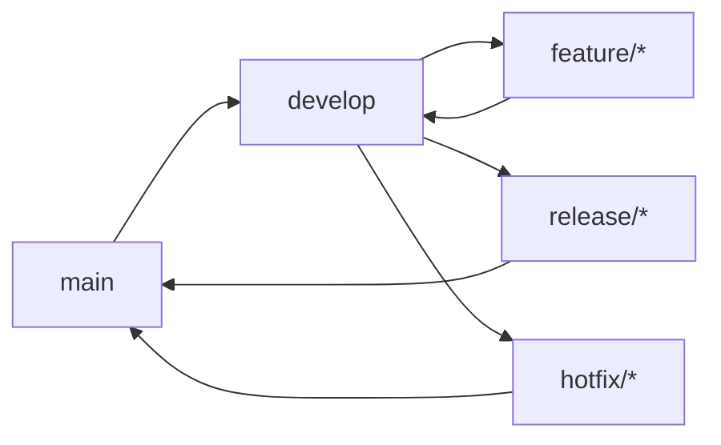

# 🤝 Guía de Contribución - DivisApp

Bienvenido al proyecto DivisApp. Esta guía proporciona toda la información necesaria para contribuir al desarrollo de la aplicación de conversión de monedas.

## Código de Conducta

Este proyecto sigue un código de conducta para asegurar un ambiente colaborativo e inclusivo. Al participar, aceptas:

- Ser respetuoso con todos los colaboradores
- Mantener un lenguaje profesional
- Aceptar constructivamente la retroalimentación
- Enfocarte en lo que es mejor para el proyecto

## Primeros Pasos

### 1. Configuración del Entorno de Desarrollo

#### Requisitos Previos

```bash
# Verificar versiones
node --version  # v18.0.0+
npm --version   # v9.0.0+
ionic --version # v7.0.0+
```

#### Clonar y Configurar

```bash
# Clonar repositorio
git clone https://github.com/your-org/divisapp.git
cd divisapp

# Instalar dependencias
npm install

# Configurar Capacitor
npx cap sync

# Verificar instalación
npm run lint
npm run test
```

### 2. Configuración del IDE

#### VS Code Recomendado

Extensiones requeridas:
- Angular Language Service
- TypeScript Importer
- Prettier
- ESLint
- Ionic

#### Configuración del Workspace

```json
// .vscode/settings.json
{
  "typescript.preferences.importModuleSpecifier": "relative",
  "editor.formatOnSave": true,
  "editor.defaultFormatter": "esbenp.prettier-vscode",
  "editor.codeActionsOnSave": {
    "source.fixAll.eslint": true
  },
  "emmet.includeLanguages": {
    "typescript": "html"
  }
}
```

## Flujo de Trabajo de Desarrollo

### Git Flow Strategy



#### Ramas Principales

- **`main`**: Código de producción estable
- **`develop`**: Desarrollo activo con últimas features

#### Ramas de Trabajo

- **`feature/*`**: Nuevas funcionalidades
- **`bugfix/*`**: Corrección de bugs
- **`hotfix/*`**: Parches críticos para producción
- **`release/*`**: Preparación de releases

### Conventional Commits

```bash
# Formato: type(scope): description

# Ejemplos
git commit -m "feat: add currency conversion validation"
git commit -m "fix(ui): handle negative amounts in input"
git commit -m "docs: update deployment guide"
git commit -m "refactor(core): extract validation logic to service"
git commit -m "test: add unit tests for exchange service"
git commit -m "chore: update dependencies"
```

#### Tipos de Commit

- **`feat`**: Nueva funcionalidad
- **`fix`**: Corrección de bug
- **`docs`**: Cambios en documentación
- **`style`**: Cambios de formato/código
- **`refactor`**: Refactorización de código
- **`test`**: Añadir/modificar tests
- **`chore`**: Tareas de mantenimiento

## Proceso de Contribución

### 1. Elegir una Issue

```bash
# Ver issues disponibles
# Buscar etiquetas: good first issue, help wanted, enhancement
```

### 2. Crear Rama de Trabajo

```bash
# Para nueva feature
git checkout develop
git pull origin develop
git checkout -b feature/add-exchange-rate-history

# Para bug fix
git checkout develop
git pull origin develop
git checkout -b bugfix/fix-conversion-precision
```

### 3. Desarrollo

#### Estructura de Commits

```bash
# Commits pequeños y frecuentes
git add .
git commit -m "feat: implement basic exchange rate history"

git add .
git commit -m "test: add unit tests for history service"

git add .
git commit -m "docs: update component documentation"
```

#### Code Quality Checks

```bash
# Ejecutar antes de push
npm run lint
npm run test:ci
npm run build
```

### 4. Pull Request

#### Template de PR

```markdown
## Descripción
Breve descripción de los cambios realizados.

## Tipo de Cambio
- [ ] Bug fix
- [ ] New feature
- [ ] Breaking change
- [ ] Documentation update

## Checklist
- [ ] Tests unitarios añadidos/modificados
- [ ] Documentación actualizada
- [ ] Linting pasa
- [ ] Build exitoso
- [ ] Tests pasan

## Issues Relacionadas
Closes #123

## Screenshots (si aplica)
[Agregar screenshots de cambios UI]
```

#### Proceso de Revisión

1. **Automated Checks**: CI/CD ejecuta tests y linting
2. **Code Review**: Mínimo 1 aprobación requerida
3. **Testing**: QA valida funcionalidad
4. **Merge**: Squash merge a develop

## Estándares de Código

### TypeScript

```typescript
// ✅ Correcto
interface CurrencyConversion {
  amount: number;
  from: string;
  to: string;
  result: number;
  timestamp: Date;
}

export class ExchangeService {
  convert(amount: number, from: string, to: string): CurrencyConversion {
    // Implementation
  }
}

// ❌ Incorrecto
export class exchangeService {
  convert(amount, from, to) {
    // No types, poor naming
  }
}
```

### Angular Components

```typescript
// ✅ Standalone Component Pattern
@Component({
  selector: 'app-currency-input',
  template: `
    <ion-item>
      <ion-label>{{ label }}</ion-label>
      <ion-input
        type="number"
        [value]="value"
        (ionChange)="onValueChange($event)">
      </ion-input>
    </ion-item>
  `,
  imports: [IonItem, IonLabel, IonInput],
  standalone: true
})
export class CurrencyInputComponent {
  @Input() label = '';
  @Input() value = 0;
  @Output() valueChange = new EventEmitter<number>();

  onValueChange(event: any): void {
    const value = parseFloat(event.detail?.value) || 0;
    this.valueChange.emit(value);
  }
}
```

### Testing

```typescript
// ✅ Comprehensive Test
describe('ExchangeService', () => {
  let service: ExchangeService;

  beforeEach(() => {
    TestBed.configureTestingModule({});
    service = TestBed.inject(ExchangeService);
  });

  describe('convert', () => {
    it('should convert valid amounts', () => {
      const result = service.convert(16, 'GTQ', 'USD');
      expect(result.result).toBe(2);
      expect(result.from).toBe('GTQ');
      expect(result.to).toBe('USD');
    });

    it('should handle edge cases', () => {
      expect(() => service.convert(-1, 'GTQ', 'USD'))
        .toThrowError('Amount cannot be negative');
    });
  });
});
```

## Testing y QA

### Ejecutar Tests Localmente

```bash
# Unit tests
npm run test

# Tests con cobertura
npm run test:coverage

# E2E tests
npm run e2e

# Tests específicos
npm run test -- --include="**/exchange.service.spec.ts"
```

### Checklist de QA

- [ ] Funcionalidad básica funciona
- [ ] Validación de inputs
- [ ] Manejo de errores
- [ ] Performance en dispositivos móviles
- [ ] Accesibilidad (WCAG 2.1 AA)
- [ ] Compatibilidad iOS/Android

## Documentación

### Actualizar Documentación

```bash
# Para cambios en código
# Actualizar JSDoc comments
# Actualizar README si cambia API pública

# Para nueva funcionalidad
# Añadir sección en docs/
# Actualizar diagramas si aplica
```

### Guías de Documentación

- Usar JSDoc para funciones públicas
- Mantener README actualizado
- Documentar breaking changes
- Incluir ejemplos de uso

## Troubleshooting

### Problemas Comunes

#### Build Fails

```bash
# Limpiar cache
rm -rf node_modules package-lock.json
npm install

# Verificar TypeScript errors
npx tsc --noEmit
```

#### Tests Failing

```bash
# Ejecutar tests específicos
npm run test -- --include="**/failing-test.spec.ts"

# Debug mode
npm run test -- --browsers=Chrome
```

#### Capacitor Issues

```bash
# Re-sync platforms
npx cap sync

# Clean build
rm -rf android ios
npx cap add android
npx cap add ios
```

### Obtener Ayuda

- **Issues**: Para bugs o feature requests
- **Discussions**: Para preguntas generales
- **Slack/Teams**: Para comunicación en tiempo real
- **Docs**: Revisar documentación primero

## Recompensas y Reconocimiento

### Niveles de Contribución

- **Contributor**: Primer PR mergeado
- **Regular Contributor**: 5+ PRs mergeados
- **Core Contributor**: Reviews consistentes, arquitectura

### Reconocimiento

- Menciones en release notes
- Créditos en documentación
- Invitaciones a meetings técnicos
- Swag para contribuidores destacados

## Políticas del Proyecto

### Versionado Semántico

- **MAJOR**: Cambios incompatibles
- **MINOR**: Nuevas funcionalidades
- **PATCH**: Bug fixes

### Soporte de Versiones

- **Latest**: Última versión estable
- **LTS**: Versiones con soporte extendido (6 meses)
- **EOL**: Versiones sin soporte

### Deprecation Policy

- 2 versiones de antelación para funcionalidades críticas
- 1 versión para funcionalidades menores
- Comunicación clara en release notes

## Conclusiones

Contribuir a DivisApp es una excelente manera de:

✅ **Aprender**: Tecnologías modernas (Ionic, Angular, Capacitor)
✅ **Crecer**: Mejores prácticas de desarrollo enterprise
✅ **Contribuir**: Impacto real en usuarios
✅ **Colaborar**: Trabajo en equipo con profesionales
✅ **Reconocimiento**: Créditos por tu trabajo

¡Gracias por contribuir a hacer DivisApp mejor! 🚀