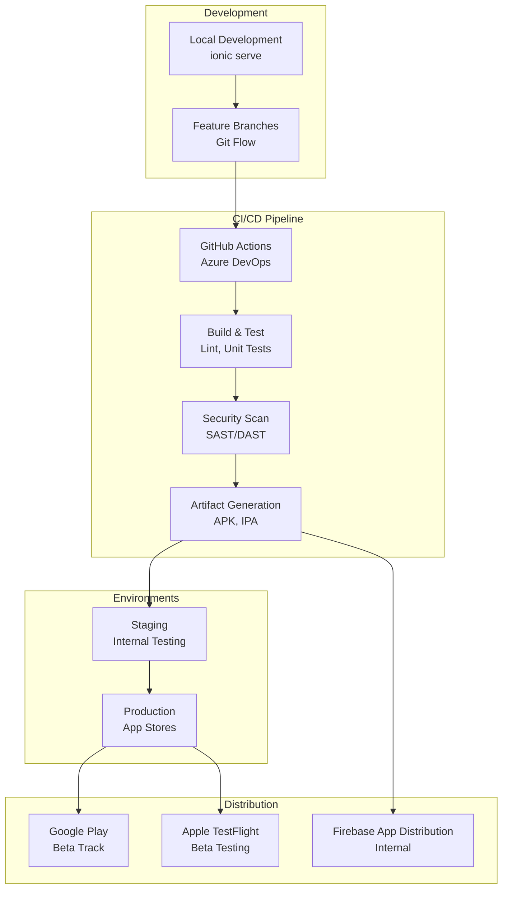

# 🚀 Guía de Despliegue - DivisApp

Esta guía detalla las estrategias de despliegue enterprise para DivisApp, incluyendo pipelines CI/CD, gestión de entornos y mejores prácticas de DevOps.

## Arquitectura de Despliegue



## Entornos de Despliegue

### 1. Desarrollo Local
```bash
# Servidor de desarrollo con hot reload
npm start

# Desarrollo con dispositivo físico
ionic capacitor run android --livereload
ionic capacitor run ios --livereload
```

### 2. Entorno de Staging
```bash
# Build para staging
npm run build -- --configuration=staging

# Sincronizar con Capacitor
npx cap sync

# Generar APK de staging
npx cap build android --configuration=staging
```

### 3. Entorno de Producción
```bash
# Build optimizado
npm run build -- --prod

# Sincronizar y build
npx cap sync
npx cap build android --prod --release
```

## Pipeline CI/CD

### GitHub Actions Workflow

```yaml
name: DivisApp CI/CD

on:
  push:
    branches: [ main, develop ]
  pull_request:
    branches: [ main, develop ]

jobs:
  test:
    runs-on: ubuntu-latest
    steps:
      - uses: actions/checkout@v3
      - name: Setup Node.js
        uses: actions/setup-node@v3
        with:
          node-version: '18'
          cache: 'npm'

      - name: Install dependencies
        run: npm ci

      - name: Lint code
        run: npm run lint

      - name: Run tests
        run: npm run test:ci

      - name: Build
        run: npm run build

  security:
    runs-on: ubuntu-latest
    needs: test
    steps:
      - uses: actions/checkout@v3
      - name: Run SAST
        uses: github/super-linter@v4
        env:
          DEFAULT_BRANCH: main
          GITHUB_TOKEN: ${{ secrets.GITHUB_TOKEN }}

  deploy-staging:
    runs-on: ubuntu-latest
    needs: [test, security]
    if: github.ref == 'refs/heads/develop'
    steps:
      - name: Deploy to staging
        run: |
          echo "Deploying to staging environment"
          # Implementar despliegue a staging

  deploy-production:
    runs-on: ubuntu-latest
    needs: [test, security]
    if: github.ref == 'refs/heads/main'
    steps:
      - name: Deploy to production
        run: |
          echo "Deploying to production environment"
          # Implementar despliegue a producción
```

### Azure DevOps Pipeline

```yaml
trigger:
  branches:
    include:
    - main
    - develop

pool:
  vmImage: 'ubuntu-latest'

stages:
- stage: Build
  jobs:
  - job: BuildAndTest
    steps:
    - task: NodeTool@0
      inputs:
        versionSpec: '18.x'

    - script: npm ci
      displayName: 'Install dependencies'

    - script: npm run lint
      displayName: 'Run linting'

    - script: npm run test:ci
      displayName: 'Run unit tests'

    - script: npm run build
      displayName: 'Build application'

    - publish: $(System.DefaultWorkingDirectory)/www
      artifact: build-artifacts

- stage: Security
  dependsOn: Build
  jobs:
  - job: SecurityScan
    steps:
    - task: securedevelopmentteam.vss-secure-development-tools.build-task-eslint-security/eslint-security@1
      displayName: 'Run ESLint Security'

- stage: DeployStaging
  dependsOn: Security
  condition: and(succeeded(), eq(variables['Build.SourceBranch'], 'refs/heads/develop'))
  jobs:
  - deployment: DeployStaging
    environment: 'staging'
    strategy:
      runOnce:
        deploy:
          steps:
          - script: echo "Deploy to staging"

- stage: DeployProduction
  dependsOn: Security
  condition: and(succeeded(), eq(variables['Build.SourceBranch'], 'refs/heads/main'))
  jobs:
  - deployment: DeployProduction
    environment: 'production'
    strategy:
      runOnce:
        deploy:
          steps:
          - script: echo "Deploy to production"
```

## Configuración de Entornos

### Variables de Entorno

```typescript
// src/environments/environment.prod.ts
export const environment = {
  production: true,
  apiUrl: 'https://api.divisapp.com',
  analytics: {
    enabled: true,
    trackingId: 'GA_TRACKING_ID'
  },
  monitoring: {
    sentry: {
      dsn: 'SENTRY_DSN'
    }
  }
};
```

### Capacitor Configuration

```typescript
// capacitor.config.ts
import { CapacitorConfig } from '@capacitor/cli';

const config: CapacitorConfig = {
  appId: 'io.ionic.divisapp',
  appName: 'DivisApp',
  webDir: 'www',
  bundledWebRuntime: false,
  plugins: {
    StatusBar: {
      style: environment.production ? 'DEFAULT' : 'DARK'
    }
  }
};

export default config;
```

## Estrategias de Distribución

### Google Play Store

```bash
# Generar bundle de producción
npx cap build android --prod

# Firmar APK
jarsigner -verbose -sigalg SHA1withRSA -digestalg SHA1 \
  -keystore release.keystore \
  android/app/build/outputs/apk/release/app-release-unsigned.apk \
  alias_name

# Alinear APK
zipalign -v 4 \
  android/app/build/outputs/apk/release/app-release-unsigned.apk \
  android/app/build/outputs/apk/release/divisapp.apk

# Subir a Play Console
# Usar Google Play Developer API o manual upload
```

### Apple App Store

```bash
# Build para iOS
npx cap build ios --prod

# Abrir en Xcode
npx cap open ios

# En Xcode:
# 1. Seleccionar Generic iOS Device
# 2. Product > Archive
# 3. Distribute App > App Store Connect
# 4. Upload
```

### Firebase App Distribution

```yaml
# Firebase distribution en CI/CD
- name: Distribute to Firebase
  uses: wzieba/Firebase-Distribution-Github-Action@v1
  with:
    appId: ${{ secrets.FIREBASE_APP_ID }}
    token: ${{ secrets.FIREBASE_TOKEN }}
    groups: testers
    file: android/app/build/outputs/apk/release/divisapp.apk
```

## Monitoreo y Rollback

### Health Checks

```typescript
// src/app/core/services/health.service.ts
@Injectable({ providedIn: 'root' })
export class HealthService {
  checkHealth(): Observable<HealthStatus> {
    return this.http.get<HealthStatus>('/health');
  }
}
```

### Rollback Strategy

```bash
# Rollback script
#!/bin/bash
echo "Starting rollback process..."

# Revertir código
git revert HEAD~1 --no-edit
git push origin main

# Revertir release en stores
# Implementar API calls para revertir versiones

echo "Rollback completed"
```

## Métricas de Despliegue

### KPIs de Despliegue

- **Deployment Frequency**: Múltiples por día (CI/CD)
- **Lead Time for Changes**: <1 hora
- **Change Failure Rate**: <5%
- **Time to Recovery**: <15 minutos

### Monitoreo Post-Despliegue

```typescript
// src/app/core/services/monitoring.service.ts
@Injectable({ providedIn: 'root' })
export class MonitoringService {
  trackDeployment(version: string) {
    // Track deployment metrics
    this.analytics.track('deployment', { version });
  }

  trackErrors(error: Error) {
    // Send to error tracking service
    this.sentry.captureException(error);
  }
}
```

## Seguridad en Despliegue

### Secret Management

```yaml
# GitHub Secrets
- FIREBASE_TOKEN
- SENTRY_DSN
- PLAY_STORE_KEY
- APP_STORE_CONNECT_KEY

# Azure Key Vault integration
- Database credentials
- API keys
- Certificates
```

### Code Signing

```xml
<!-- Android signing config -->
<android>
  <signingConfigs>
    <release>
      <storeFile>release.keystore</storeFile>
      <storePassword>${STORE_PASSWORD}</storePassword>
      <keyAlias>${KEY_ALIAS}</keyAlias>
      <keyPassword>${KEY_PASSWORD}</keyPassword>
    </release>
  </signingConfigs>
</android>
```

## Optimizaciones de Performance

### Bundle Optimization

```javascript
// angular.json optimizations
"optimization": true,
"buildOptimizer": true,
"sourceMap": false,
"namedChunks": false,
"aot": true,
"extractLicenses": true,
"vendorChunk": false,
"buildOptimizer": true
```

### CDN y Caching

```typescript
// service worker para PWA
// Implementar caching strategies
// CDN para assets estáticos
```

## Conclusiones

La estrategia de despliegue de DivisApp sigue las mejores prácticas DevOps:

✅ **Automated Pipelines**: CI/CD completo con testing y seguridad
✅ **Multi-Environment**: Desarrollo, staging y producción
✅ **Security First**: Code signing y secret management
✅ **Monitoring**: Métricas y health checks
✅ **Rollback Ready**: Estrategias de recuperación
✅ **Performance**: Optimizaciones de bundle y caching

Esta arquitectura asegura despliegues confiables, seguros y escalables.