# 📊 Diagramas y Flujos de Datos - DivisApp

Esta sección contiene diagramas detallados de navegación, comunicación entre servicios y flujos de datos de la aplicación DivisApp.

## Diagrama de Navegación

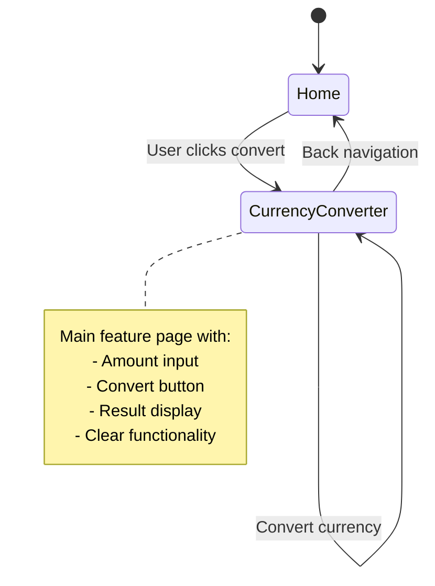

## Flujo de Conversión de Moneda

```mermaid
flowchart TD
    A[User enters amount] --> B{Validate input}
    B -->|Invalid| C[Show error message]
    B -->|Valid| D[Call ExchangeService.convertGTQToUSD()]
    D --> E{Conversion successful?}
    E -->|No| F[Handle error<br/>Show user message]
    E -->|Yes| G[Update UI with result]
    G --> H[Display converted amount]
    H --> I[Enable copy to clipboard]

    C --> A
    F --> A
```

## Comunicación entre Servicios

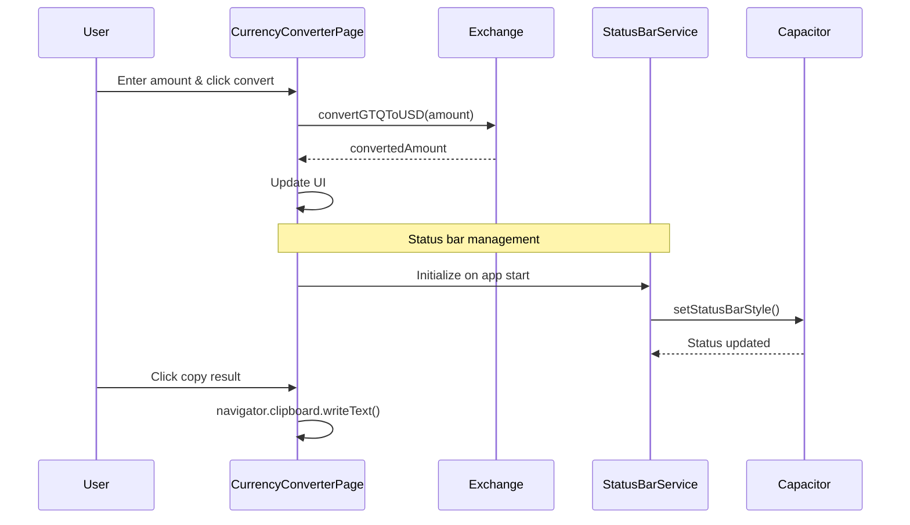

## Arquitectura de Datos

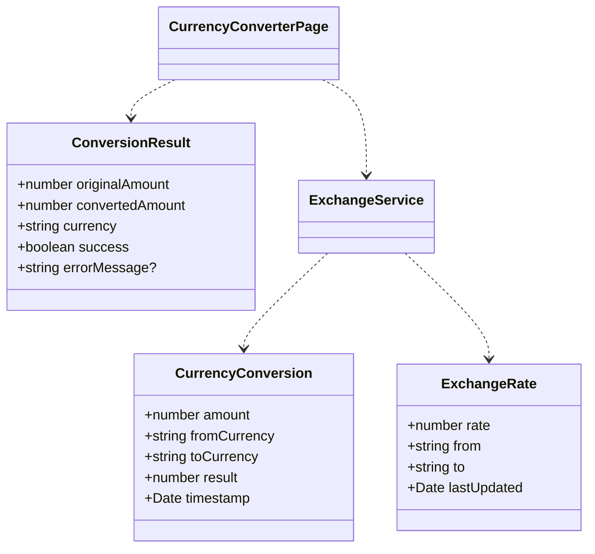

## Flujo de Inicialización de la App

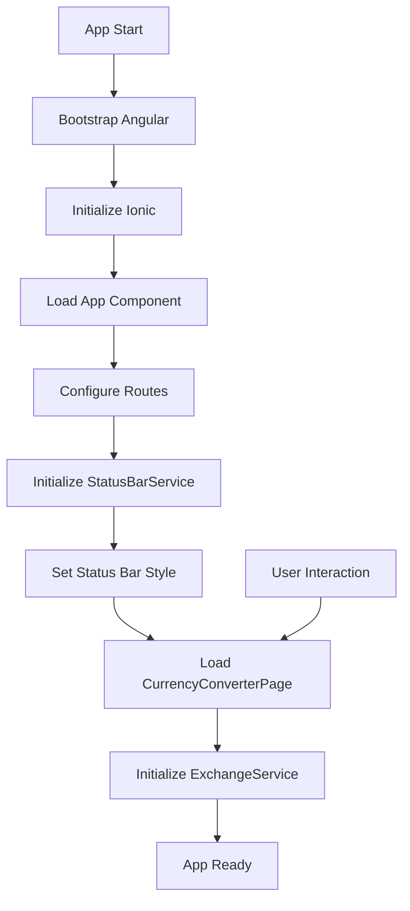

## Diagrama de Estados de la UI

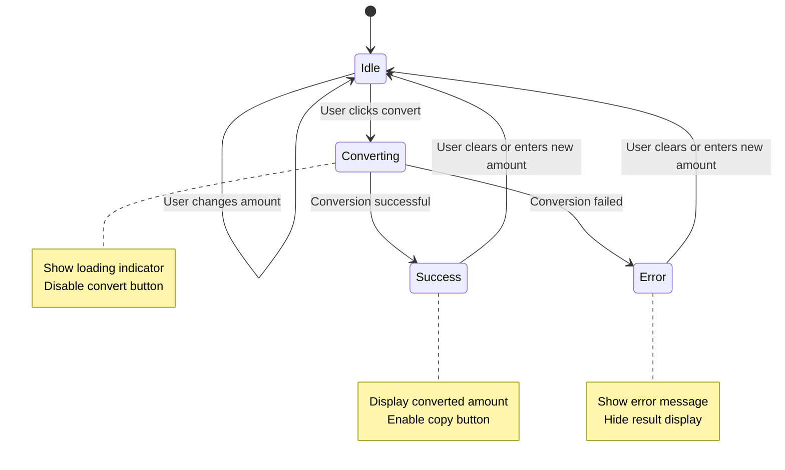

## Flujo de Error Handling

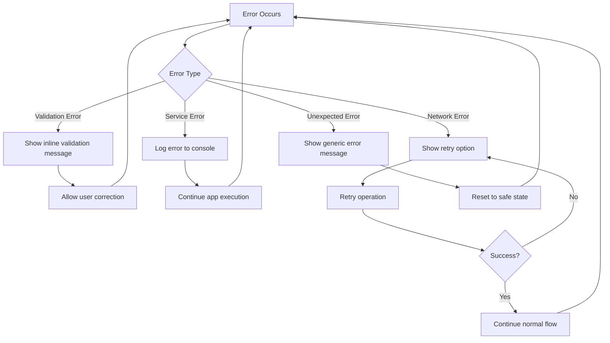

## Diagrama de Dependencias

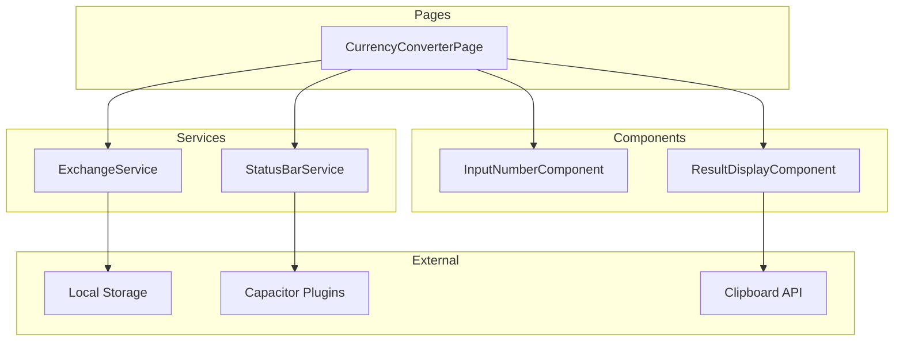

## Flujo de Build y Despliegue

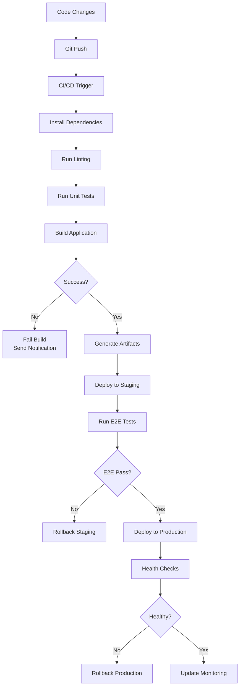

## Diagrama de Monitoreo

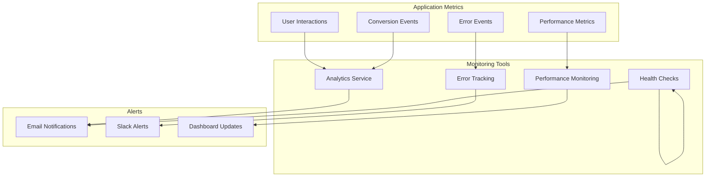

## Arquitectura de Seguridad

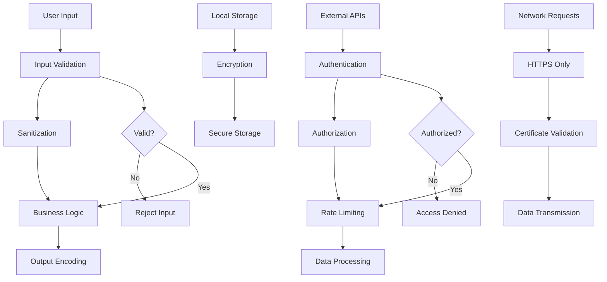

## Diagrama de Escalabilidad

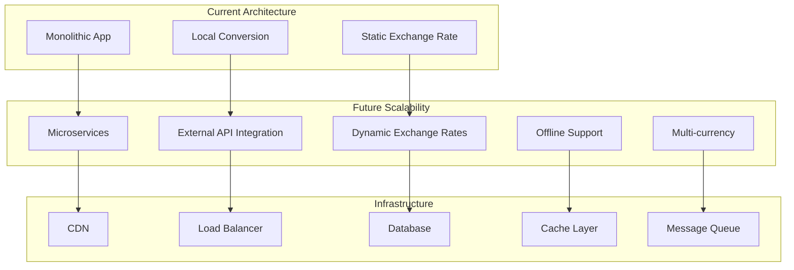

## Flujo de Usuario Completo

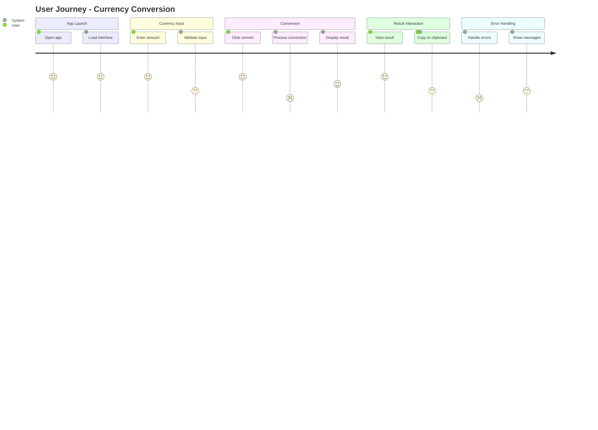

Estos diagramas proporcionan una visión completa de cómo funciona DivisApp a nivel técnico, desde la navegación del usuario hasta la comunicación interna entre componentes y servicios.