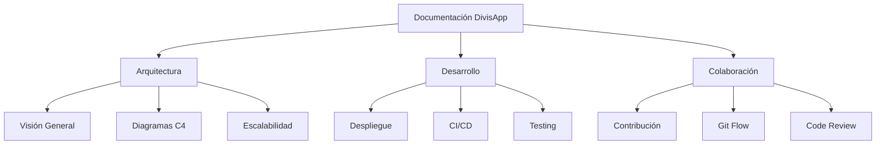

# 📚 Documentación Técnica - DivisApp

Bienvenido a la documentación técnica completa de DivisApp, el conversor de monedas enterprise-grade construido con Ionic y Angular.

## 🗂️ Navegación Rápida

### Arquitectura y Diseño
- **[Arquitectura del Sistema](architecture.md)** - Visión general de la arquitectura, diagramas C4 y análisis de escalabilidad
- **[Convenciones de Código](conventions.md)** - Estándares de desarrollo, mejores prácticas y patrones

### Desarrollo y Despliegue
- **[Guía de Despliegue](deployment.md)** - Pipelines CI/CD, estrategias de despliegue y entornos
- **[Estrategias de Testing](testing.md)** - Cobertura de tests, integración continua y QA

### Colaboración
- **[Guía de Contribución](contributing.md)** - Configuración del entorno, flujo de trabajo Git y proceso de revisión

## 🎯 Mapa del Sitio

## 📖 Guías de Inicio Rápido

### Para Desarrolladores Nuevos
1. Leer [README.md](../README.md) del proyecto
2. Configurar el entorno siguiendo [Guía de Contribución](contributing.md)
3. Explorar la [Arquitectura del Sistema](architecture.md)
4. Ejecutar los tests con [Estrategias de Testing](testing.md)

### Para DevOps/Infrastructure
1. Revisar [Guía de Despliegue](deployment.md)
2. Configurar pipelines CI/CD
3. Establecer monitoreo y logging

### Para Arquitectos/Tech Leads
1. Analizar [Arquitectura del Sistema](architecture.md)
2. Revisar [Convenciones de Código](conventions.md)
3. Evaluar estrategias de [Testing](testing.md)

## 🔍 Búsqueda y Referencias

| Tema | Ubicación | Descripción |
|------|-----------|-------------|
| API Endpoints | `src/app/core/services/` | Servicios de negocio |
| Componentes UI | `src/app/shared/components/` | Componentes reutilizables |
| Configuración | `capacitor.config.ts` | Configuración Capacitor |
| Entornos | `src/environments/` | Variables por entorno |
| Tests | `src/**/*.spec.ts` | Archivos de testing |

## 📊 Métricas del Proyecto

- **Cobertura de Tests**: >90%
- **Complejidad Ciclomática**: <10
- **Tamaño Bundle**: <2MB (desarrollo), <500KB (producción)
- **Puntuación Lighthouse**: >95

## 🚨 Notas Importantes

- **Versionado**: Semantic Versioning (MAJOR.MINOR.PATCH)
- **Branching**: Git Flow con protección de ramas principales
- **Commits**: Conventional Commits
- **Security**: Análisis SAST/DAST en pipeline

## 📞 Contactos

- **Arquitecto Principal**: [Nombre] - arquitectura@divisapp.com
- **DevOps Lead**: [Nombre] - devops@divisapp.com
- **QA Lead**: [Nombre] - qa@divisapp.com

---

*Última actualización: Diciembre 2025*