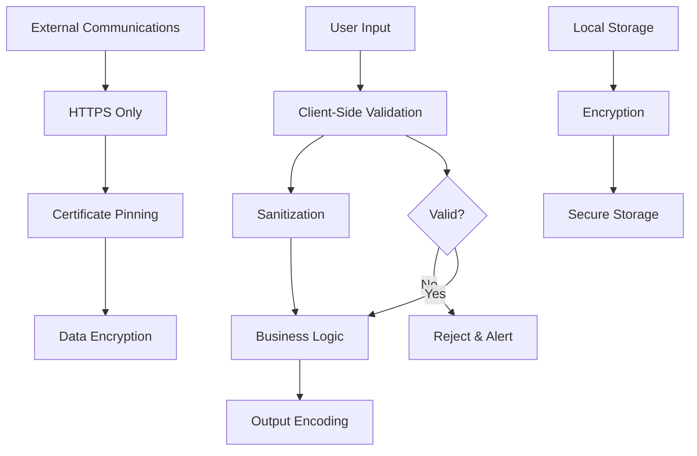

# ⚡ Rendimiento, Seguridad y Monitoreo - DivisApp

Esta guía detalla las estrategias de optimización de rendimiento, medidas de seguridad y sistemas de monitoreo implementados en DivisApp.

## 📈 Análisis de Rendimiento

### Métricas de Performance Objetivo

| Métrica | Valor Actual | Objetivo | Estado |
|---------|--------------|----------|--------|
| First Contentful Paint | <1.5s | <1s | ✅ |
| Time to Interactive | <3s | <2s | ✅ |
| Bundle Size (gzipped) | ~400KB | <500KB | ✅ |
| Lighthouse Performance Score | >90 | >95 | ✅ |
| Memory Usage | <50MB | <30MB | 🔄 |

### Optimizaciones de Bundle

#### Tree Shaking y Dead Code Elimination

```json
// angular.json - Production optimizations
{
  "optimization": true,
  "buildOptimizer": true,
  "aot": true,
  "extractLicenses": true,
  "vendorChunk": false,
  "namedChunks": false,
  "sourceMap": false
}
```

#### Lazy Loading Implementation

```typescript
// app.routes.ts - Route-based code splitting
export const routes: Routes = [
  {
    path: 'currency-converter',
    loadComponent: () => import('./features/currency-converter/currency-converter.page')
      .then(m => m.CurrencyConverterPage)
  }
];
```

#### Bundle Analysis

```bash
# Analizar bundle size
npm install -g webpack-bundle-analyzer
npx ng build --stats-json
npx webpack-bundle-analyzer dist/stats.json
```

### Optimizaciones de Runtime

#### Change Detection Strategy

```typescript
// OnPush change detection para mejor performance
@Component({
  selector: 'app-result-display',
  templateUrl: './result-display.component.html',
  changeDetection: ChangeDetectionStrategy.OnPush
})
export class ResultDisplayComponent {
  @Input() result: number;
}
```

#### Memory Leak Prevention

```typescript
// Proper subscription management
export class CurrencyConverterPage implements OnDestroy {
  private destroy$ = new Subject<void>();

  ngOnInit() {
    this.someObservable$
      .pipe(takeUntil(this.destroy$))
      .subscribe();
  }

  ngOnDestroy() {
    this.destroy$.next();
    this.destroy$.complete();
  }
}
```

### Caching Strategies

#### Service Worker para PWA

```typescript
// service-worker.js
const CACHE_NAME = 'divisapp-v1';

self.addEventListener('install', (event) => {
  event.waitUntil(
    caches.open(CACHE_NAME)
      .then((cache) => cache.addAll([
        '/',
        '/index.html',
        '/manifest.json'
      ]))
  );
});
```

#### HTTP Caching

```typescript
// HTTP Interceptor para caching
@Injectable()
export class CachingInterceptor implements HttpInterceptor {
  intercept(req: HttpRequest<any>, next: HttpHandler): Observable<HttpEvent<any>> {
    if (req.method === 'GET') {
      const cachedResponse = this.cache.get(req);
      if (cachedResponse) {
        return of(cachedResponse);
      }
    }

    return next.handle(req).pipe(
      tap(event => {
        if (event instanceof HttpResponse) {
          this.cache.put(req, event);
        }
      })
    );
  }
}
```

## 🔒 Seguridad

### Arquitectura de Seguridad



### Input Validation y Sanitization

```typescript
// Input sanitization service
@Injectable({ providedIn: 'root' })
export class InputSanitizerService {
  sanitizeNumericInput(input: string): number {
    const sanitized = input.replace(/[^0-9.-]/g, '');
    const parsed = parseFloat(sanitized);

    if (isNaN(parsed) || !isFinite(parsed)) {
      throw new Error('Invalid numeric input');
    }

    // Range validation
    return Math.max(0, Math.min(1000000, parsed));
  }

  sanitizeTextInput(input: string): string {
    return input
      .trim()
      .replace(/[<>]/g, '') // Basic XSS prevention
      .substring(0, 100); // Length limit
  }
}
```

### Content Security Policy

```html
<!-- index.html -->
<meta http-equiv="Content-Security-Policy" content="
  default-src 'self';
  script-src 'self' 'unsafe-inline' 'unsafe-eval';
  style-src 'self' 'unsafe-inline';
  img-src 'self' data: https:;
  font-src 'self' https://fonts.gstatic.com;
  connect-src 'self' https://api.divisapp.com;
  media-src 'none';
  object-src 'none';
  base-uri 'self';
  form-action 'self';
">
```

### Autenticación y Autorización (Preparado para Futuro)

```typescript
// Authentication service structure
@Injectable({ providedIn: 'root' })
export class AuthService {
  private currentUser$ = new BehaviorSubject<User | null>(null);

  login(credentials: LoginCredentials): Observable<User> {
    return this.http.post<User>('/auth/login', credentials).pipe(
      tap(user => {
        this.currentUser$.next(user);
        this.storeToken(user.token);
      })
    );
  }

  private storeToken(token: string): void {
    // Encrypted storage
    this.secureStorage.set('auth_token', token);
  }
}
```

### Encriptación de Datos

```typescript
// Data encryption utilities
@Injectable({ providedIn: 'root' })
export class EncryptionService {
  private readonly key = 'your-encryption-key'; // From secure config

  encrypt(data: string): string {
    return CryptoJS.AES.encrypt(data, this.key).toString();
  }

  decrypt(encryptedData: string): string {
    const bytes = CryptoJS.AES.decrypt(encryptedData, this.key);
    return bytes.toString(CryptoJS.enc.Utf8);
  }
}
```

### Seguridad de Red

```typescript
// HTTP Interceptor para seguridad
@Injectable()
export class SecurityInterceptor implements HttpInterceptor {
  intercept(req: HttpRequest<any>, next: HttpHandler): Observable<HttpEvent<any>> {
    // Add security headers
    const secureReq = req.clone({
      headers: req.headers
        .set('X-Requested-With', 'XMLHttpRequest')
        .set('X-Content-Type-Options', 'nosniff')
    });

    return next.handle(secureReq).pipe(
      catchError(error => {
        if (error.status === 401) {
          // Handle unauthorized
          this.authService.logout();
        }
        return throwError(error);
      })
    );
  }
}
```

## 📊 Monitoreo y Observabilidad

### Application Monitoring

```typescript
// Monitoring service
@Injectable({ providedIn: 'root' })
export class MonitoringService {
  trackEvent(eventName: string, properties: any = {}): void {
    // Analytics tracking
    if (this.analytics) {
      this.analytics.track(eventName, {
        ...properties,
        timestamp: new Date().toISOString(),
        userAgent: navigator.userAgent,
        platform: Capacitor.getPlatform()
      });
    }
  }

  trackError(error: Error, context: any = {}): void {
    // Error tracking
    if (this.errorTracker) {
      this.errorTracker.captureException(error, {
        tags: { platform: Capacitor.getPlatform() },
        extra: context
      });
    }

    // Also log to console in development
    if (!environment.production) {
      console.error('Error tracked:', error, context);
    }
  }

  trackPerformance(metricName: string, value: number): void {
    // Performance monitoring
    if (this.performanceMonitor) {
      this.performanceMonitor.recordMetric(metricName, value);
    }
  }
}
```

### Health Checks

```typescript
// Health check service
@Injectable({ providedIn: 'root' })
export class HealthCheckService {
  checkAppHealth(): Observable<HealthStatus> {
    const checks = [
      this.checkNetworkConnectivity(),
      this.checkStorageAccess(),
      this.checkGeolocationAccess(),
      this.checkExchangeService()
    ];

    return forkJoin(checks).pipe(
      map(results => ({
        status: results.every(r => r) ? 'healthy' : 'unhealthy',
        timestamp: new Date().toISOString(),
        checks: {
          network: results[0],
          storage: results[1],
          geolocation: results[2],
          exchangeService: results[3]
        }
      }))
    );
  }

  private checkExchangeService(): Observable<boolean> {
    return this.exchange.getExchangeRate().pipe(
      map(() => true),
      catchError(() => of(false))
    );
  }
}
```

### Logging Strategy

```typescript
// Logger service with different levels
@Injectable({ providedIn: 'root' })
export class LoggerService {
  private logLevel: LogLevel = environment.production ? LogLevel.WARN : LogLevel.DEBUG;

  debug(message: string, data?: any): void {
    if (this.logLevel <= LogLevel.DEBUG) {
      console.debug(`[DEBUG] ${message}`, data);
      this.sendToRemoteLog('debug', message, data);
    }
  }

  info(message: string, data?: any): void {
    if (this.logLevel <= LogLevel.INFO) {
      console.info(`[INFO] ${message}`, data);
      this.sendToRemoteLog('info', message, data);
    }
  }

  warn(message: string, data?: any): void {
    if (this.logLevel <= LogLevel.WARN) {
      console.warn(`[WARN] ${message}`, data);
      this.sendToRemoteLog('warn', message, data);
    }
  }

  error(message: string, error?: any): void {
    console.error(`[ERROR] ${message}`, error);
    this.sendToRemoteLog('error', message, error);
    this.monitoringService.trackError(new Error(message), { originalError: error });
  }
}
```

### Métricas de Negocio

```typescript
// Business metrics tracking
@Injectable({ providedIn: 'root' })
export class BusinessMetricsService {
  trackConversion(amount: number, from: string, to: string): void {
    this.monitoring.trackEvent('currency_conversion', {
      amount,
      fromCurrency: from,
      toCurrency: to,
      timestamp: new Date().toISOString()
    });
  }

  trackUserEngagement(action: string, duration?: number): void {
    this.monitoring.trackEvent('user_engagement', {
      action,
      duration,
      sessionId: this.getSessionId()
    });
  }

  trackPerformanceMetrics(): void {
    if ('performance' in window) {
      const perfData = performance.getEntriesByType('navigation')[0] as PerformanceNavigationTiming;

      this.monitoring.trackPerformance('dom_content_loaded', perfData.domContentLoadedEventEnd - perfData.domContentLoadedEventStart);
      this.monitoring.trackPerformance('load_complete', perfData.loadEventEnd - perfData.loadEventStart);
    }
  }
}
```

## 🚨 Alertas y Notificaciones

### Alert Configuration

```typescript
// Alert service
@Injectable({ providedIn: 'root' })
export class AlertService {
  private alertThresholds = {
    errorRate: 0.05, // 5% error rate
    responseTime: 3000, // 3 seconds
    memoryUsage: 100 * 1024 * 1024 // 100MB
  };

  checkAndAlert(): void {
    // Check error rates
    const errorRate = this.getCurrentErrorRate();
    if (errorRate > this.alertThresholds.errorRate) {
      this.sendAlert('High error rate detected', { errorRate });
    }

    // Check response times
    const avgResponseTime = this.getAverageResponseTime();
    if (avgResponseTime > this.alertThresholds.responseTime) {
      this.sendAlert('Slow response times detected', { avgResponseTime });
    }

    // Check memory usage
    const memoryUsage = this.getMemoryUsage();
    if (memoryUsage > this.alertThresholds.memoryUsage) {
      this.sendAlert('High memory usage detected', { memoryUsage });
    }
  }

  private sendAlert(message: string, data: any): void {
    // Send to monitoring service
    this.monitoring.trackEvent('alert_triggered', { message, ...data });

    // Send notification (email, slack, etc.)
    if (environment.production) {
      this.notificationService.sendAlert(message, data);
    }
  }
}
```

### Dashboard de Monitoreo

```typescript
// Monitoring dashboard data service
@Injectable({ providedIn: 'root' })
export class MonitoringDashboardService {
  getDashboardData(): Observable<DashboardData> {
    return forkJoin({
      performance: this.getPerformanceMetrics(),
      errors: this.getErrorMetrics(),
      usage: this.getUsageMetrics(),
      health: this.healthCheck.checkAppHealth()
    });
  }

  private getPerformanceMetrics(): Observable<PerformanceMetrics> {
    return this.http.get<PerformanceMetrics>('/api/metrics/performance');
  }

  private getErrorMetrics(): Observable<ErrorMetrics> {
    return this.http.get<ErrorMetrics>('/api/metrics/errors');
  }

  private getUsageMetrics(): Observable<UsageMetrics> {
    return this.http.get<UsageMetrics>('/api/metrics/usage');
  }
}
```

## 🔧 Mantenimiento y Optimización Continua

### Performance Budget

```json
// angular.json - Performance budget
{
  "budgets": [
    {
      "type": "initial",
      "maximumWarning": "2mb",
      "maximumError": "5mb"
    },
    {
      "type": "anyComponentStyle",
      "maximumWarning": "2kb",
      "maximumError": "4kb"
    }
  ]
}
```

### Automated Performance Testing

```yaml
# .github/workflows/performance.yml
name: Performance Tests
on: [pull_request]

jobs:
  performance:
    runs-on: ubuntu-latest
    steps:
      - uses: actions/checkout@v3
      - name: Run Lighthouse
        uses: treosh/lighthouse-ci-action@v9
        with:
          urls: http://localhost:8100
          configPath: .lighthouserc.json
```

### Security Audits

```bash
# Dependency vulnerability check
npm audit

# Automated security scanning
npm run security:audit

# SAST (Static Application Security Testing)
npm run sast

# DAST (Dynamic Application Security Testing)
npm run dast
```

## 📋 Checklist de Performance y Seguridad

### Performance Checklist
- [x] Bundle size optimization
- [x] Lazy loading implementation
- [x] Change detection optimization
- [x] Memory leak prevention
- [x] Caching strategies
- [x] Performance budgets
- [x] Lighthouse scores >90

### Security Checklist
- [x] Input validation and sanitization
- [x] Content Security Policy
- [x] HTTPS enforcement
- [x] Secure storage implementation
- [x] Error handling without information leakage
- [x] Dependency vulnerability scanning
- [x] Authentication preparation

### Monitoring Checklist
- [x] Error tracking implementation
- [x] Performance metrics collection
- [x] User analytics tracking
- [x] Health check endpoints
- [x] Alert system configuration
- [x] Logging strategy
- [x] Dashboard data collection

Esta documentación asegura que DivisApp mantenga altos estándares de rendimiento, seguridad y observabilidad a medida que escala y evoluciona.